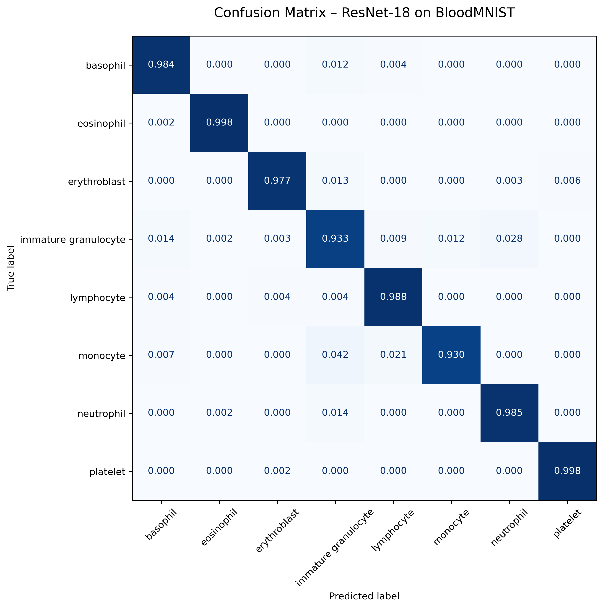
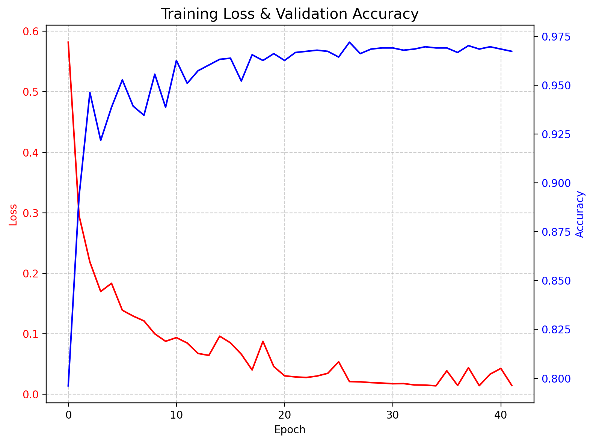
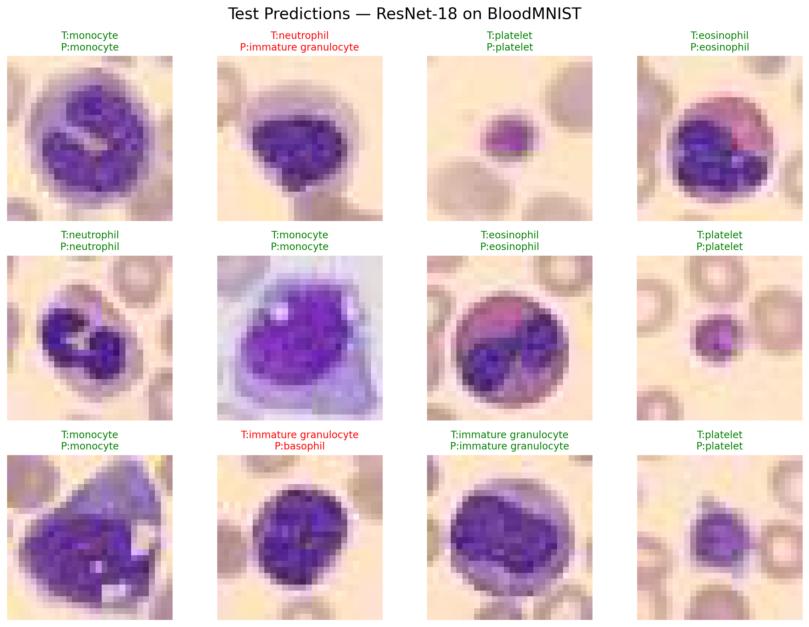

# BloodMNIST Classification with Adapted ResNet-18


**97.52% Test Accuracy • 0.9733 Macro F1 • Single pretrained ResNet-18 • 28×28 images**

This repository provides a reproducible training pipeline for the BloodMNIST (from MedMNIST v2) using an adapted pretrained ResNet-18 architecture. The goal is to demonstrate solid performance using a minimal configuration that adhere to modern PyTorch best practices.

### Final Results (42 Epochs via Early Stopping, seed 42)

The results reflect the latest successful training run (post-refactoring).

### Confusion Matrix


### Training Curves


### Sample Predictions


### Final Results (60 epochs, seed 42)
| Metric                  | Value     |
|-------------------------|-----------|
| Best Validation Accuracy| **97.55%** |
| Test Accuracy (with TTA)| **97.11%** |
| Test Macro F1 (with TTA)| **0.9678** |

→ Confusion matrix, training curves, sample predictions and Excel report are automatically saved.

---

### Why this repo exists

I wanted to see how far a **single pretrained ResNet-18** could go on the tiny 28×28 BloodMNIST dataset with proper adaptation and modern training practices — no Ensembles, no ViTs, no custom backbones.

Spoiler: a carefully adapted ResNet-18 performs surprisingly well, even on 28×28 medical images.

---

### Key Features & Design Choices (Post-Refactoring)

The code has been cleanly separated into modulare components (`data_handler.py`, `models.py`,
`trainer.py`, `utils.py`) for enhaced clarity and maintainability.

- **ResNet-18 adapted for 28×28**:  
  – Initial 7 x7 convolution replaced with 3 x 3. 
  – Initial `MaxPool` removed to preserve 28 x 28 feature maps.
  – ImageNet pretrained weights transferred via bicubic upsampling of the first convolutional layer.
  – Reproduciblity & Robustness: – Full Reproducibility guaranteed (fixed seeds for PyTorch, NumPy, Python). – `worker_init_fn` implemented to ensure determinism even when using multiple data loading workers (`num_workers > 0).
  – Defensive Utilities: Robust dataset download with MD5 validation and atomic write ensures pipeline reliablity.

---

### The Small Utilities That Save Large Headaches

A few tiny helpers included in this repo were added after very real 5AM debugging incidents:

- **`get_base_dir()`** — ensures outputs never end up in unexpected system locations  
- **`kill_duplicate_processes()`** — stops accidental multi-launches that hog all RAM  
- **`ensure_mnist_npz()`** — safe dataset download with retries, MD5 check, and atomic write  
- Graceful process cleanup, checksum utilities, debug-safe file creation, etc.

They may look overkill, but they make the whole training pipeline safe to run unattended.

---

### Project Structure

```bash
bloodmnist/
│
├── main.py                   # Main script that initiates training/evaluation
│
├── data_handler.py           # Handles data download, Dataset, and DataLoader setup
├── models.py                 # Defines the adapted ResNet-18 model
├── trainer.py                # Contains the training logic (loop, MixUp, Early Stopping)
├── utils.py                  # Configuration (Config), Logger, and general utilities
│
├── dataset/                  # BloodMNIST dataset files
├── logs/                     # File logs
├── figures/                  # Auto-generated plots
├── reports/                  # Excel report + final logs
└── models/                   # Saved model checkpoints
```

### Requirements

```bash
pip install -r requirements.txt
```

Install dependencies easily with pip, or check the full list here:

[📦 See Full Requirements](requirements.txt)


### Usage

```bash
git clone https://github.com/tomrussobuilds/bloodmnist.git
cd bloodmnist
python main.py
```
Note: The entry point script is now `main.py`.

The script will automatically:

- Download BloodMNIST if missing
- Train for max 60 epochs with early stopping (`patience=15`)
- Save the best model → `models/resnet18_bloodmnist_best.pth`
- Generate figures, confusion matrix, Excel report → `figures/` and `reports/`

### Command Line Arguments (argparse)
You can fully configure training from the command line (via `main.py`).

| Arg | Type | Default | Description |
| :--- | :--- | :--- | :--- |
| --epochs | int | 60 | Maximum number of training epochs. |
| --batch_size | int | 128 | Batch size for data loaders. |
| --lr | float | 0.008 | Initial learning rate for the SGD optimizer. |
| --seed | int | 42 | Random seed for reproducibility (influences PyTorch, NumPy, Python). |
| --mixup_alpha | float | 0.002 | $\alpha$ parameter for MixUp regularization. Set to 0 to disable MixUp. |
| --patience | int | 15 | Early stopping patience (epochs without validation improvement). |
| --no_tta | flag | (disabled) | Flag to disable Test-Time Augmentation (TTA) during final evaluation. |

Examples:

Run without TTA

```bash
python main.py --no_tta
```
Train for 100 epochs

```bash
python main.py --epochs 100
```
Lower LR for finer tuning

```bash
python main.py --lr 0.001
```
Disable MixUp

```bash
python main.py --mixup_alpha 0
```
Custom batch size & seed

```bash
python main.py --barch_size 64 --seed 123
```

### Reproducibility

The entire pipeline is deterministic (seed 42). Run the script twice wille yield the same validation curve and the same final accuracy.

### Citation

If you use this repository in academic work or derivative projects:

```bibtex
@misc{bloodmnist_resnet18,
  title  = {BloodMNIST Classification with Adapted ResNet-18},
  author = {Tommaso Russo},
  year   = {2025},
  url    = {https://github.com/tomrussobuilds/bloodmnist}
}
```

### Conclusion

This project demonstrates how a classic, lightweight architecture like ResNet-18 can perform extremely well on a compact medical-image dataset when paired with a careful, modern training setup.

The goal is to provide a clean, stable, reproducible pipeline that others can reuse or extend with minimal friction.

If you find this project useful, feedback and suggestions are always welcome!